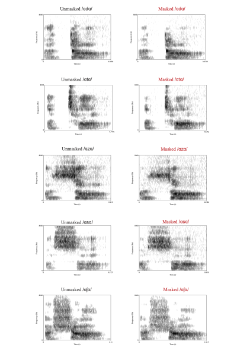

```{r echo=FALSE,message=FALSE}
try(setwd("~/OneDrive - Cardiff University/Supervision/UGDissertations/Havill/experiment/analysis"))
```

# Introduction


# A note on multimodal explanations of speech perception problems with facemasks

Lipreading is an important strategy used by all listeners, regardless of hearing impairment, to improve speech perception through visual cues telegraphed from the speaker’s face, including lip and jaw movement (Jeffers & Barley, 1971; Campbell et al., 1997). Facemasks cover a portion of our face that contains important linguistic information, including place of production for consonants (closed lips suggest bilabial plosives, /p, b/), and vowel height (open jaw illustrates an open vowel, /a/). This visual information, in tandem with the speech signal, aids overall speech perception (Yi et al., 2021). Previous studies have proven that the loss of visual information caused by facemasks can inhibit speech perception, and that reintroducing visual information via a clear plastic screen can improve speech perception in hearing impaired and normal-hearing adults (Atcherson et al., 2017; Thibodeau et al 2021; Yi et al., 2021). 

Thibodeau et al. (2021) tested the effects of visual information on speech perception with facemasks in noise. Two mask types were tested: a cotton mask with a transparent vinyl screen and the same mask with a piece of cotton covering the screen, therefore, the only change across mask type was the loss of visual information. Participants were presented with sentence stimuli from the Hearing in Noise Test (Nilsson et al., 1994). Listeners were tasked with transcribing a set of stimuli in both mask conditions, then accurate transcription scores were compared across mask types. Thibodeau et al. (2021) found that the use of transparent facemasks significantly facilitated speech recognition in noise, regardless of hearing ability, and observed a mean 10 percentage-point increase in correct perception from the opaque mask to transparent mask. 

Although these results provide evidence of the importance of visual information when communicating with facemasks, CDC (2021) advise that people avoid transparent plastic masks as they are not considered sufficiently breathable. Despite this, the National Association of the Deaf (NAD), a non-peer-reviewed website, suggest wearing transparent masks to aid speech perception in people who are hard-of-hearing (National Association of the Deaf, 2020). The studies cited regarding lipreading do provide one answer as to how facemasks affect speech perception; they do not, however, cover other ways facemasks may affect speech perception e.g., forms of acoustic degradation.

Jeffers, J. & Barley, M. (1971). Speechreading (Lipreading). Springfield, Illinois: Charles C Thomas

Campbell, R., Zihl. J., Massaro, D., Munhall, K., Cohen, M.M. (1997) Speechreading in the akinetopsic patient. Brain 120 (10). pp. 1793-1803

Yi, H., Pingsterhaus, A. and Song, W. (2021) Effects of Wearing Face Masks While Using Different Speaking Styles in Noise on Speech Intelligibility During the COVID-19 Pandemic. Front. Psychol. 12.

Thibodeau, L.M., Thibodeau-Nielsen, R.B., Tran, C.M.Q., Jacob, R.T.S. (2021). Communicating During COVID-19: The Effect of Transparent Masks for Speech Recognition in Noise. Ear Hear. 42(4), pp.772-781.

Nilsson. M., Soli, S.D., Sullivan, J.A. (1994). Development of the Hearing in Noise Test for the measurement of speech reception thresholds in quiet and in noise. J Acoust Soc Am 95(2).

National Association of the Deaf. (2020). COVID-19: Deaf and hard of hearing communication access recommendations for the hospital. Available at: https://www.nad.org/COVID19-communication-access-recs-for-hospital/ (accessed: 16th October 2021) 


\newpage
\clearpage

# Load libraries

```{r message=FALSE,warning=FALSE}
library(dplyr)
library(ggplot2)
library(lme4)
library(car)
library(sjPlot)
library(party)
library(ggpubr)
library(lattice)
```


# Acoustic analysis

Make power spectrum graphs from Praat data. The function aggregates samples into bins of frequency (default is 25hz wide). The just noticable difference data comes from [Long (2014)](https://www.sciencedirect.com/science/article/pii/B9780123982582000039). I'm using the 5dB data since it's most conservative.

```{r}
# Function to summarise one data file
summariseData = function(d,upperRange = 8000, samplingWindow = 25){
  # Cut data above upper range
  d = d[d$freq.Hz.<=upperRange,]
  
  sampleBoundaries = seq(0,upperRange,by=samplingWindow)
  sampleMidpoints = sampleBoundaries + samplingWindow/2
  
  d$sampleBin = cut(d$freq.Hz., sampleBoundaries)
  
  d.win = data.frame(
    freq.Hz. = sampleMidpoints[1:(length(sampleMidpoints))-1],
    pow.dB.Hz. = tapply(d$pow.dB.Hz.,d$sampleBin,mean)
  )
  return(d.win)
}

jndHz = c(35,70,200,1000,4000,8000,10000)
# at 5db
jndDB = c(9.3,5.7,4.7,3.0,2.5,4.0,4.7)
# at 10db
jndDB10db = c(7.8, 4.2, 3.4, 2.3, 1.7, 2.8, 3.3)
jndSpline = smooth.spline(jndHz,jndDB,df = 6,all.knots = T)

makePowerDifferenceGraph = function(maskedFile, unmaskedFile,mainTitle="",plotXLAB=TRUE,plotYLAB=TRUE){
  # Load and summarise data
  d.masked = summariseData(read.csv(maskedFile))
  d.unmasked = summariseData(read.csv(unmaskedFile))
  
  # Plot raw power
  plot(d.unmasked$freq.Hz., d.unmasked$pow.dB.Hz., type='l', 
       xlab="Frequency (Hz)", ylab="Power (dB)",
       main=mainTitle, ylim=c(-32,35))
  points(d.masked$freq.Hz., d.masked$pow.dB.Hz., type='l', col='2')
  legend(5000,32,legend=c("Unmasked","Masked"),col=1:2,lty=1)
  
  # Plot difference in power
  d.masked$diff = d.masked$pow.dB.Hz. - d.unmasked$pow.dB.Hz.
  
  d.masked$dbMax = predict(jndSpline, x = d.masked$freq.Hz.)$y
  d.masked$dbMin = - d.masked$dbMax
  
  attenuation = d.masked$diff - d.masked$dbMin
  print(sum(attenuation[attenuation<0]))
  
  plot(d.masked$freq.Hz., d.masked$diff, type='l',
       xlab="Frequency (Hz)", ylab= "Difference in power (dB)",
       main = mainTitle, ylim=c(-25,10))
  abline(h=0,col=rgb(0,0,0,0.4))
  #points(jndHzFullScale, jndDBFullScale,type = "l",col='light gray')
  #points(jndHzFullScale, -jndDBFullScale,type = "l",col='light gray')
  
  gx = ggplot(d.masked, aes(x=freq.Hz., y = diff)) + 
    geom_ribbon(aes(x=freq.Hz., ymin=dbMin, ymax=dbMax),
                alpha = 0.3) +
    geom_hline(yintercept = 0,colour="dark gray") +
    geom_line(alpha=0.9) +
    ylim(c(-24,10))
  
  if(plotXLAB){
    gx = gx + xlab("Frequency (Hz)")
  } else{
    gx = gx + theme(axis.title.x = element_blank())
  }
  if(plotYLAB){
    gx = gx + ylab("PD (db)")
  } else{
    gx = gx + theme(axis.title.y = element_blank())
  }
  
  return(gx)

}

# Apply the functions to all the files

#pdf("PowerAnalyses.pdf", width=6, height=5)
dx = summariseData(read.csv("../data/AcousticAnalysis/Masked_D.Table.csv"))
dx$dbMax = predict(jndSpline, x = dx$freq.Hz.)$y
dx$dbMin = - dx$dbMax

guideGraph =   ggplot(dx,aes(x = freq.Hz., y=20)) +
  geom_ribbon(aes(x=freq.Hz., ymin=dbMin, ymax=dbMax),
              alpha = 0.3) +
  #geom_hline(yintercept = 0) +
  geom_line(alpha=0.9) +
  coord_cartesian(ylim=c(-24,10)) +
  ylab("PD (db)") + theme(axis.title.x = element_blank()) +
  annotate("text",x = 500,y=8,label="Fascemask increases intensity",hjust="left") +
  annotate("text",x = 500, y = -10, label="Fascemask decreases intensity",hjust="left") +
  annotate("text",x = 500, y = 0, label="No Noticable Difference",colour="#525252",hjust="left")

gD = makePowerDifferenceGraph("../data/AcousticAnalysis/Masked_D.Table.csv", "../data/AcousticAnalysis/Unmasked_D.Table.csv", "/d/",F,F) +
  annotate("text", x = 500,y=-15,label="/d/",size =8)
gT = makePowerDifferenceGraph("../data/AcousticAnalysis/Masked_T.Table.csv", "../data/AcousticAnalysis/Unmasked_T.Table.csv", "/t/",F,T) +
  annotate("text", x = 500,y=-15,label="/t/",size =8)
gZ = makePowerDifferenceGraph("../data/AcousticAnalysis/Masked_Z.Table.csv", "../data/AcousticAnalysis/Unmasked_Z.Table.csv", "/z/",F,F) +
  annotate("text", x = 500,y=-15,label="/z/",size =8)
gS = makePowerDifferenceGraph("../data/AcousticAnalysis/Masked_S.Table.csv", "../data/AcousticAnalysis/Unmasked_S.Table.csv", "/s/",T,T) +
  annotate("text", x = 500,y=-15,label="/s/",size =8)
gSH = makePowerDifferenceGraph("../data/AcousticAnalysis/Masked_SH.Table.csv", "../data/AcousticAnalysis/Unmasked_SH.Table.csv", "/sh/",T,F) +
  annotate("text", x = 500,y=-15,label="/ʃ/",size =8)
#dev.off()

gx = ggarrange(guideGraph, gD, gT, gZ, gS, gSH,
          nrow = 3,ncol=2,heights = c(1,1,1.2))

gx

grDevices::cairo_pdf("../results/AcousticAnalysis.pdf",width=6,height = 6)
gx
dev.off()
```


According to the area under the just noticable difference curve, we should expect the perception accuracy to be ordered /s/ < /t/ < /z/ < /sh/ < /d/. This turns out not to agree with the experimental results below.




\newpage
\clearpage

# Experiment

## Load data

```{r}
d2 = read.csv('../data/cleanedData.csv')

d2$target = factor(d2$target,
      levels=c("zoo","sue","to","do","jus","shoe","loo","rue"))

```

## Descriptive statistics

Number of participants:

```{r}
length(unique(d2$IDNum))
```

Number of observations (one observation has missing data due to a technical error.):

```{r}
nrow(d2)
```

Overall percentage correct:

```{r}
mean(d2$correct)*100
```

Percentage correct by condition:

```{r}
tapply(d2$correct,d2$condition,mean)*100
```

Percentage correct by target:

```{r}
t(t(tapply(d2$correct, d2$target,mean)*100))
```

Percentage correct by target for masked condition:

```{r}
sel = d2$condition=="Masked"
t(t(tapply(d2[sel,]$correct, d2[sel,]$target,mean)*100))
```

Percentage correct by target for unmasked condition:

```{r}
sel = d2$condition=="Unmasked"
t(t(tapply(d2[sel,]$correct, d2[sel,]$target,mean)*100))
```

\clearpage
\newpage

## Visualisation of raw data

Main correct responses:

```{r message=F,warning=F}
px1 = d2 %>% group_by(condition) %>%
  summarise(
    correct= mean(correct)*100
  ) %>% ggplot(aes(y=correct,x=condition,fill=condition)) +
  geom_bar(stat="identity") +
  ylim(c(0,100)) +
  ylab("% correct responses")
pdf("../results/RawCorrectByCondition.pdf",height=4,width=6)
px1
dev.off()
px1
```

```{r message=F,warning=F}
px2 = d2 %>% group_by(condition,target) %>%
  summarise(
    correct= mean(correct)*100
  ) %>% ggplot(aes(y=correct,x=target,fill=condition)) +
  geom_bar(stat="identity",position="dodge") +
  ylim(c(0,100)) +
  ylab("% correct responses")
pdf("../results/RawCorrectByTargetAndCondition.pdf",height=4,width=6)
px2
dev.off()
px2
```

```{r message=F,warning=F}
px3 = d2 %>% group_by(condition,voicing) %>%
  summarise(
    correct= mean(correct)*100
  ) %>% ggplot(aes(y=correct,x=voicing,fill=condition)) +
  geom_bar(stat="identity",position="dodge") +
  ylim(c(0,100)) +
  ylab("% correct responses")
pdf("../results/RawCorrectByConditionAndVoicing.pdf",height=4,width=6)
px3
dev.off()
px3
```

```{r message=F,warning=F}
px4 = d2 %>% group_by(condition,manner) %>%
  summarise(
    correct= mean(correct)*100
  ) %>% ggplot(aes(y=correct,x=manner,fill=condition)) +
  geom_bar(stat="identity",position="dodge") +
  ylim(c(0,100)) +
  ylab("% correct responses")
pdf("../results/RawCorrectByConditionAndManner.pdf",height=4,width=6)
px4
dev.off()
px4

# Combined
pdf("../results/RawCorrectByCondition_Manner_Voicing.pdf",
    width=6,height=3)
ggarrange(px3 + theme(legend.position = "none"),
          px4 + theme(axis.title.y = element_blank()),
          widths = c(1,1.4))
dev.off()
```

\clearpage
\newpage

## Visualisation of confusion matrices

Use a heatmap to visualise the errors that participants make. Redder colours indicate more frequent decisions.

```{r}
makeHeatmap = function(filename,label){
  confusionMatrix = read.csv(filename, stringsAsFactors = F, row.names = 1)
  confusionMatrix = as.matrix(confusionMatrix)
  confusionMatrix = 1 - (confusionMatrix/max(confusionMatrix))
  heatmap(as.matrix(confusionMatrix),Colv = "Rowv",
          margins = c(10,10),col=heat.colors(100),main = label)
  pdf(paste0("../results/Heatmap_",label,".pdf"))
  heatmap(as.matrix(confusionMatrix),Colv = "Rowv",
          margins = c(10,10),col=heat.colors(100),
          main = label)
  dev.off()
  heatmap(as.matrix(confusionMatrix),Colv = "Rowv",
          margins = c(10,10),col=heat.colors(100),
          main = label)
}
makeHeatmap("../data/confusionMatrix.csv","All data")
makeHeatmap("../data/confusionMatrix_Masked.csv","Masked")
makeHeatmap("../data/confusionMatrix_Unmasked.csv","Unmasked")
```


\clearpage
\newpage


## Statistical analysis

By itself, condition is a significant predictor of the proportion of correct responses:

```{r}
chisq.test(table(d2$condition,d2$correct))
```

The different targets also have different proportions of correct responses:

```{r}
chisq.test(table(d2$target,d2$correct))
```

However, this is only part of the story. We use a binomial regression, predicting whether each trial is correct according to the target, the masked/unmasked condition and the interaction between the two. We also include a random intercept for participant. A random effect for condition is not used because that is a factor we are manipulation, and is operationally defined to have finite categories.

```{r echo=F,eval=F}
# Old linear model (virtually identical)
m0X = glm(correct~target*condition,
         data=d2, family = "binomial")
m0XSummary = summary(m0X)
m0XSummary

write.csv(m0XSummary$coefficients,"../results/ModelCoefficients.csv")

# LR Chisq tests for main effects
car::Anova(m0X)
```


```{r}
mBase0 = glmer(correct~ condition + 
             (1 | IDNum),
         data=d2, family = "binomial", 
         control = glmerControl(optimizer = "bobyqa"))
mBase1 = update(mBase0, ~. + target)
mBase2 = update(mBase1, ~. + condition:target)
m0 = glmer(correct~target*condition + 
             (1 | IDNum),
         data=d2, family = "binomial", 
         control = glmerControl(optimizer = "bobyqa"))
m0Summary = summary(m0)
m0Summary

write.csv(m0Summary$coefficients,"../results/ModelCoefficients.csv")

# LR Chisq tests for main effects
car::Anova(m0)
# Model comparisons for main effects
anova(mBase0,mBase1,mBase2)
```

\clearpage
\newpage

Plot the output of the model:

```{r}
pts = plot_model(m0,"pred") 
pm1 = pts[[1]] + theme(panel.grid.minor.x=element_blank()) +
  ylim(c(0,1))
pm2 = pts[[2]] + theme(panel.grid.minor.x=element_blank()) +
  ylim(c(0,1))

pm3 = plot_model(m0,"int", axis.lim = c(0,1)) + 
  theme(panel.grid.minor.x = element_blank()) +
  ylim(c(0,1))

pm1
pm2
pm3

pdf("../results/ModelPredictions_Target.pdf",height=4,width=6)
pm1
dev.off()

pdf("../results/ModelPredictions_Condition.pdf",height=4,width=6)
pm2
dev.off()

pdf("../results/ModelPredictions_Interaction.pdf",height=4,width=6)
pm3
dev.off()
```


\clearpage
\newpage

## Bayesian estimation model

The mixed effects model above converges well, but only when using the bobyqa method. Additionally, when adding a random effect for target, the glmer model above does not converge well. To check whether the estimation framework is biasing our results, we run a model using Bayesian estimation of coefficients. The implementation below uses uninformative priors. The point is simply to check whether the same qualitative results are reached using a different estimation algorithm.

```{r, warning=FALSE,comment=FALSE,message=FALSE,cache=TRUE}
library(brms)
m0B = brm(correct~target*condition + 
             (1 | IDNum) + (0 + target | IDNum),
          iter = 10000,warmup = 1000,
         data=d2, family = "bernoulli", silent = T)
knitr::kable(summary(m0B)$fixed,digits = 4)
```

Plot the results. The effects are qualitatively the same as for the mixed effects model above.

```{r warning=F,comment=F,warning=F,message=F}
ptsB = plot_model(m0B,"pred") 
pm1B = ptsB[[1]] + theme(panel.grid.minor.x=element_blank()) +
  ylim(c(0,1))
pm2B = ptsB[[2]] + theme(panel.grid.minor.x=element_blank()) +
  ylim(c(0,1))
pm3B = plot_model(m0B,"int", axis.lim = c(0,1)) + 
  theme(panel.grid.minor.x = element_blank()) +
  ylim(c(0,1))

pm1B
pm2B
pm3B
```

Coefficients are highly correlated between implementations:

```{r}
cor(summary(m0B)$fixed[,"Estimate"],
     summary(m0)$coefficients[,"Estimate"])
```

The differences between estimates are shown below. In cases where there are sizable differences, the Bayesian estimates are more extreme.

```{r}
diffx = data.frame(
  MixedEffects = summary(m0)$coefficients[,"Estimate"],
  Bayesian = summary(m0B)$fixed[,"Estimate"])
diffx$Difference = diffx$Bayesian - diffx$MixedEffects
diffx
```


\clearpage
\newpage

## Binary decision tree

The figure below shows a decision tree, the product of a machine learning algorithm that represents a series of yes/no questions to ask about the data to guess whether a subject got a trial correct or incorrect (Hothorn et al., 2006). This shows us how each condition, and the cumulative effects of conditions present across stimuli, affect the probability of a correct response. 

The tree confirms that the probability of correct responses is predicted by a complex interaction between target properties and conditions. The first split in the tree is for masked and unmasked. In the masked branch on the right, the data is further divided into four groups. The poorest performance is for unvoiced fricatives, then voiced fricatives and semivowels, and the best performance is for unvoiced stops.

```{r}
ct = ctree(factor(correct)~
             factor(condition)+
             factor(voicing)+
             factor(manner),
           data=d2)
plot(ct,terminal_panel=node_barplot(ct,id=FALSE))
pdf("../results/DecisionTree.pdf",width=12,height=6)
plot(ct,terminal_panel=node_barplot(ct,id=FALSE))
dev.off()
```

Use a random forest to compare the relative variable importance:

```{r}
cf = cforest(factor(correct)~
             factor(condition)+
             factor(voicing)+
             factor(manner),
           data=d2)
imp = varimp(cf)
dotplot(sort(imp))
```


